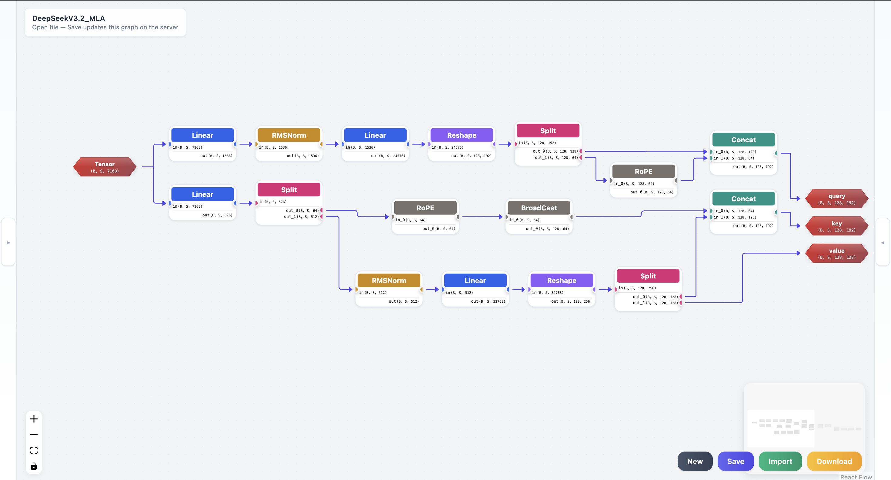

# PlayLLM

可视化神经网络模型构建工具，专为 LLM（大语言模型）架构设计而生。

## 简介

PlayLLM 是一个基于 React + TypeScript 的可视化计算图编辑器，支持通过拖拽方式创建和编辑神经网络模型架构。主要用于：

- LLM 模型架构可视化设计（如 Transformer、MLP 等）
- 模型结构分析与文档化
- 教学演示与架构探索



### 功能特性

- **可视化编辑**: 拖拽式节点放置，直观连线操作
- **Shape 推导**: 自动推导张量形状变化，实时验证
- **丰富算子**: Linear、MatMul、Softmax、EinSum、Split 等 12+ 内置算子
- **自定义算子**: 用户可创建自定义算子，定义输入/输出数量
- **LaTeX 支持**: 节点标签和端口名支持 `$...$` 语法渲染数学公式
- **工作区管理**: 多用户、多文档，草稿自动保存
- **导入/导出**: 支持 JSON 格式导入导出，便于分享
- **注释工具**: Rectangle、Text 注释节点，支持填充图案

## 技术栈

| 技术 | 版本 | 用途 |
|------|------|------|
| React | 18.2.0 | 前端框架 |
| TypeScript | 5.2.2 | 类型安全 |
| ReactFlow | 11.10.3 | 图编辑器核心 |
| Zustand | 4.4.7 | 状态管理 |
| Vite | 5.2.0 | 构建工具 |
| TailwindCSS | 3.4.19 | 样式框架 |
| KaTeX | 0.16.45 | LaTeX 公式渲染 |
| Python | 3.8+ | 后端 API（可选） |

## 快速开始

### 前端开发模式

```bash
# 进入前端目录
cd playllm

# 安装依赖
npm install

# 启动开发服务器
npm run dev
```

访问 http://localhost:3000 即可使用。

### 生产部署

**方式一：Node.js 服务器（推荐）**

```bash
# 构建前端
cd playllm
npm run build

# 启动服务器（含静态文件服务）
node server/index.mjs
```

访问 http://localhost:3000

**方式二：Python 后端 + Vite 开发服务器**

```bash
# 启动 Python 后端（端口 3001）
cd playllm/backend
python run_api.py

# 启动前端开发服务器（端口 3000）
cd playllm
npm run dev
```

前端会自动代理 API 请求到后端。

### Docker 部署

```bash
# 构建镜像
docker build -t playllm:latest .

# 运行容器
docker run -d --name playllm -p 3000:3000 -v playllm-data:/app/server-data playllm:latest
```

访问 http://localhost:3000

### 环境变量配置

可通过环境变量配置服务端口：

```bash
# 前端 Vite 开发服务器
export PLAYLLM_FRONTEND_PORT=3000  # 默认 3000

# Python 后端 API
export PLAYLLM_HOST=127.0.0.1      # 默认 127.0.0.1
export PLAYLLM_PORT=3001           # 默认 3001
```

## 使用指南

### 基本操作

1. **放置节点**: 从左侧 Operators/Data 栏拖拽节点到画布
2. **连接节点**: 从输出端口拖拽到输入端口创建连线
3. **编辑属性**: 点击节点，在右侧面板编辑参数、Shape、样式
4. **移动节点**: 方向键或 h/j/k/l 移动选中节点
5. **复制粘贴**: Ctrl+C 复制，Ctrl+V 粘贴选中节点组
6. **删除**: Delete/Backspace 删除选中节点或连线

### 工作区管理

- **用户切换**: 左侧 User 栏输入用户 ID，自动切换工作区
- **新建**: 点击 New 创建草稿文档
- **保存**: 点击 Save 保存到服务器
- **导入**: 点击 Import 导入 JSON 文件
- **导出**: 点击 Download 下载当前画布

### 节点类型

| 类型 | 说明 |
|------|------|
| **Linear** | 全连接层，参数 `out_features` |
| **Embedding** | 词嵌入层，参数 `embedding_dim` |
| **Activation** | 激活函数（ReLU/GELU/SiLU） |
| **Norm** | 层归一化（LayerNorm） |
| **MatMul** | 矩阵乘法 |
| **Softmax** | Softmax 归一化，参数 `axis` |
| **EinSum** | Einstein 求和，参数 `expression` |
| **Concat** | 张量拼接，参数 `dim` |
| **Split** | 张量分割，参数 `sizes`, `axis` |
| **ElementWise** | 逐元素操作（Add/Mul/Sub/Div） |
| **Reshape** | 形状变换，参数 `target_shape` |
| **Transpose** | 维度转置，参数 `perm` |
| **Custom** | 自定义算子 |

### Shape 推导

PlayLLM 使用符号化维度（如 `B`, `N`, `H`, `K`）保持模型无关性：

- 连线时自动推导输出 Shape
- 实时验证 Shape 兼容性
- 支持广播机制（ElementWise）
- 错误提示显示在节点底部

## 示例

### Transformer MLP Block

```
Input(B, N, H)
    │
    ▼
Linear(B, N, K)  ← out_features=K
    │
    ▼
Activation(B, N, K)  ← GELU
    │
    ▼
Linear(B, N, H)  ← out_features=H
    │
    ▼
Output(B, N, H)
```

### Attention Pattern (EinSum)

使用 EinSum 实现 Attention：

- Expression: `bshd,bthd->bsht`
- Input1: `(B, S, H, D)` - Query
- Input2: `(B, T, H, D)` - Key
- Output: `(B, S, H, T)` - Attention scores

## 项目结构

```
PlayLLM/
├── playllm/           # 前端项目
│   ├── src/
│   │   ├── components/  # React 组件
│   │   ├── nodes/       # 节点定义
│   │   ├── store/       # Zustand 状态管理
│   │   ├── types/       # TypeScript 类型
│   │   └── utils/       # 工具函数
│   ├── backend/         # Python 后端
│   └── server/          # Node.js 服务器
├── README.md           # 本文件
└── DeveloperGuide.md   # 开发者详细指南
```

## 文档

- [开发者指南](DeveloperGuide.md) - 详细的架构说明、API 文档、扩展指南

## 许可证

MIT License